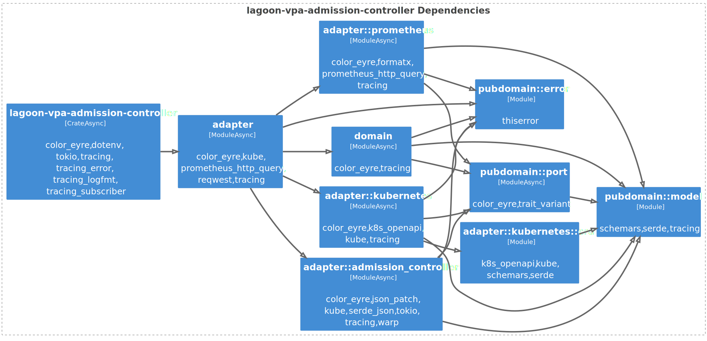

<!-- .slide: class="master-cover" -->

## Rust Clean Architecture

<br/>

### Rust Meetup<br>20.1.2025
### Daniel Tschan
<!-- .element style="margin-bottom: 12rem" --->

-*-*-

## Where does Puzzle use Rust

* S3 Proxy
* Kubernetes Operators
* Kubernetes Admission Controllers
* Kubernetes Mainenance Jobs

-*-*-

## Rust Clean Architecture

* My experiences
* Basis for discussion
* Not exhausting, there are always other approaches

-*-*-

## Goal of Software Architecture

> The goal of software architecture is to minimize the human resources required
> to build and maintain the required system.
>
> &mdash; Robert C. Martin

-*-*-

## Clean Architecture


<!-- .element style="margin-left: 2rem; margin-bottom: -1rem;" -->

Circles are just exemplary
<!-- .element style="font-size: smaller;" --->

-*-*-

## Clean Architecture

* 

-*-*-


<div class="nr"></div>

# Architecture

<!-- .slide: class="master-title" -->

-*-*-

What do example projects do?

Who implements Sync Wrapper for domain objects?

https://github.com/rust-lang/keyword-generics-initiative

Architectural Decision Records

-*-*-

## Clean Architecture Principles

* Dependency rule
  * Inner circles must not depend on outer circles
* Separation of concerns
  * A component should have only one reason to change
* Use Case-Centric
  * System is designed around business rules

note:
* https://bitloops.com/docs/bitloops-language/learning/software-architecture/clean-architecture

-*-*-

## Dependency Rule

To fullfil dependency rule:
* Implement architectural boundaries
  * Traits and generics
  * Events and channels
  * ...
* Map data and errors at architectural boundaries
* Use dependency injection to connect components

-*-*-

## Separation of Concerns

* Implement components as Rust modules
* Access other components through interfaces
* Use separate data models for each circle

-*-*-

## Use Case-Centric

* Implement business rules and use cases as separate components
* No external dependencies

-*-*-

## Architectural Boundaries

* Implemented with modules or crates
* Data Mapping
    * Error Type Mapping & Erasure
* Dependency Injection

-*-*-

## Conscious Shortcuts

* Sharing models between use cases
* Using domain model as input/output model
* Skipping incoming ports
* ...
* Document with Architectural Decision Records
* Reasoning might no longer be valid in the future

-*-*-

## Example 1: Admission Controller

* Mutating Kubernetes Admission Controller
* Initially implemented as VPA recommender
* Calculates and applies requests, limits and Java Heap sizes based on Promtheus metrics
* Architectural boundaries implemented with traits and generics

-*-*-

## Example 1 Module Dependencies


<!-- .element style="margin-left: -1rem; margin-right: -4rem; margin-top: rem" -->

Naming based on Hexagonal, aka Ports & Adapters architecture
<!-- .element style="font-size: smaller;" --->

-*-*-

## Domain Models

```rust
#[derive(Debug, Default, Clone)]
pub struct ContainerMetrics {
    pub java_live_data_set_bytes: Option<f64>,
    pub java_allocation_rate_bytes_second: Option<f64>,
    pub jvm_committed_heap_bytes: Option<f64>,
    pub memory_rss_bytes: Option<f64>,
    pub memory_working_set_bytes: Option<f64>,
    pub cpu_throttled_seconds_rate: Option<f64>,
    pub cpu_usage_seconds_rate: Option<f64>,
    pub cpu_limit_millicores: Option<f64>,
}
```
<!-- .element class="very-big" style="margin-top: 1.5rem;" --->

```rust
#[derive(Debug, Default, Clone, Serialize, Deserialize, PartialEq, JsonSchema)]
pub struct ContainerRecommendation {
    pub memory_request_mib: Option<u32>,
    pub memory_limit_mib: Option<u32>,
    pub cpu_request_millicores: Option<u32>,
    pub cpu_limit_millicores: Option<u32>,
    pub jvm_max_heap_mib: Option<u32>,
}
```

No invariants => public attributes
<!-- .element style="font-size: smaller; margin-top: -1rem;" --->

-*-*-

## Data Mapping

* Implement in outer layers
* Directly access model
* Implement `From`/`TryFrom`/`FromStr`
* Implement `from_`/`to_` methods

-*-*-

## Error Mapping

* Define error variants based on port operations
  * Only add data required for pattern matching
  * Capture other context with `tracing-error`
* Wrap errors at boundaries

-*-*-

## Error Mapping

* Erase source error types at boundaries
  * Usually with `Box<dyn Error>`
* `color-eyre` or `error-stack` help with all that
  * &rArr; Simple  error types
  * `Report` or `Report<T>` in method signatures

-*-*-

## Domain Error Example

```rust
use thiserror::Error;

#[derive(Debug, Clone, Error)]
pub enum Error {
    #[error("Failed to retrieve container metrics")]
    ContainerMetricsRetrieval,

    #[error("Failed to update recommendations")]
    RecommendationsUpdate,

    #[error("Failed to save pod recommendation")]
    PodRecommendationSave,

    #[error("Failed to load pod recommendation")]
    PodRecommendationLoad,

    // ...
```

-*-*-

## ColorEyre Example Error Log

```text
```


-*-*-

## Main/Configuration Component

* Loads configuration
* Sets up logging
* Instantiates adapters, usually as owned objects
* Instantiates core business component
* Injects configuration into components
* Injects adapters into core business component, usually by moving them

-*-*-

## Enforcing Arch Boundaries

* I.e. enforcing that dependencies point in right direction
* Visibility modifiers
* Compile-time fitness function

-*-*-

## Configuration Component


```rust
let vpa_adapter = KubernetesVpaAdapter::new(kubernetes_client);
let metrics_adapter = PrometheusMetricsAdapter::new(prometheus_client);
let recommender = LagoonRecommender::new(vpa_adapter, metrics_adapter);
let mut admission_controller = AdmissionController::new(recommender);

admission_controller.run().await;
```
<!-- .element class="very-big" --->

* In this example in the adapter module
* Allows all modules except model, error and ports to be private

-*-*-

## Dependeny Injection

* What if an object needs to be injected multiple times?
  * If struct is stateless just clone it
  * If struct is stateful implement wrapper, e.g. using `Arc<Mutex<T>>`
  * Or use message passing with channels

Inner pattern

-*-*-

## Sync Wrapper

```rust
use std::sync::Arc;
use tokio::sync::Mutex;

#[derive(Clone)]
struct SyncRecommender<R> {
    inner: Arc<Mutex<R>>,
}

impl<R: Recommender> SyncRecommender<R> {
    pub fn new(inner: R) -> Self {
        Self {
            inner: Arc::new(Mutex::new(inner)),
        }
    }
}

impl<R: Recommender> Recommender for SyncRecommender<R> {
    async fn update_recommendations(&mut self) -> Result<(), Report> {
        self.inner.lock().await.update_recommendations().await
    }
  
```
<!-- .element class="very-big" --->

-*-*-

## Async

Two strategies:
* Make the whole project async
* Only make some adapters async
  * Inject runtime handle into adapters?

-*-*-

## Whole Project Async

* Port functions need to be async:
* Best performance
* Domain logic contains async code
* Recommended when majority of adapters are async

-*-*-

## Whole Project Async

```rust  
#[trait_variant::make(MetricsAdapter: Send)]
#[allow(dead_code)]
pub trait LocalMetricsAdapter {
    async fn get_container_metrics(
        &self,
        selector: &PodSelector,
        range: u64,
    ) -> Result<BTreeMap<String, ContainerMetricsOverTime>, Report>;
}
```
<!-- .element class="very-big" --->

Macros should become obsolete when AFIT matures

-*-*-

## Only Some Adapters Async

* Ports and domain logic are sync
* Outgoing adapters need to run async code on runtime
* Can be implemented with Future extension Trait
* Overhead when switching between sync and async
* Recommended when majority of adapters are sync

-*-*-

## Future Extension Trait

```rust
pub trait SyncFutureExt: Future + Sized {
    fn sync(self) -> Self::Output {
        if let Ok(handle) = Handle::try_current() {
            // We're already inside a Tokio runtime.
            task::block_in_place(|| handle.block_on(self))
        } else {
            // Not inside a runtime: create a current-thread runtime.
            let rt = Builder::new_current_thread()
                .enable_all()
                .build()
                .expect("Failed to create current-thread Tokio runtime");
            rt.block_on(self)
        }
    }
}

impl<F: Future> SyncFutureExt for F {}
```
<!-- .element class="very-big" --->

<div>

* `block_in_place` requires multi-threaded runtime
* `rt` may need to be cached if called in tight loop

</div>
<!-- .element style="font-size: smaller; margin-left: -3rem; margin-top: -1.5rem;" --->

-*-*-

## Future Extension Trait

```rust
use crate::adapter::SyncFutureExt;

let promql_result = self.client.query(&query).get().sync()?;
```
<!-- .element class="very-big" --->

`sync()` can be used like `await` to call async code from sync code
<!-- .element style="font-size: smaller;" --->

-*-*-

## Example 2: Dication Tool

* Turns spoken text into keypresses
* Prototype for hardware solution
* Architectural boundaries implemented with events and channels