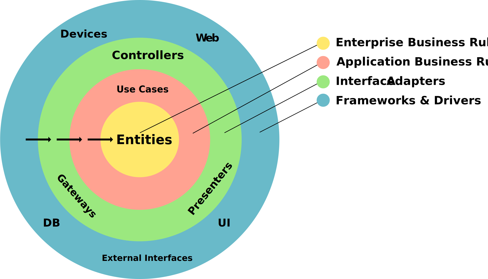
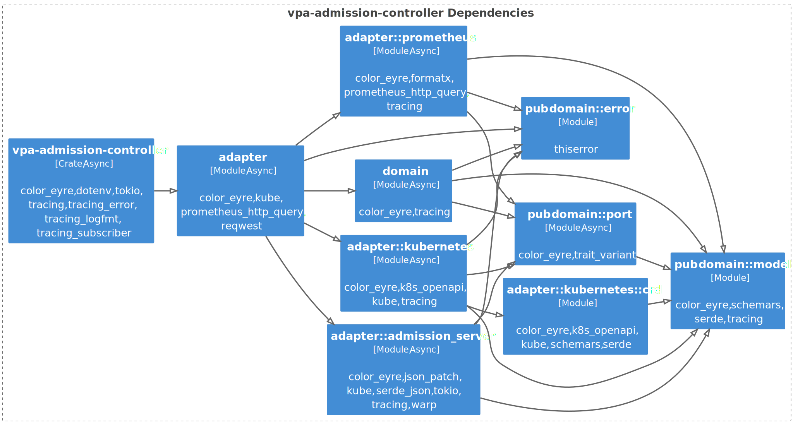
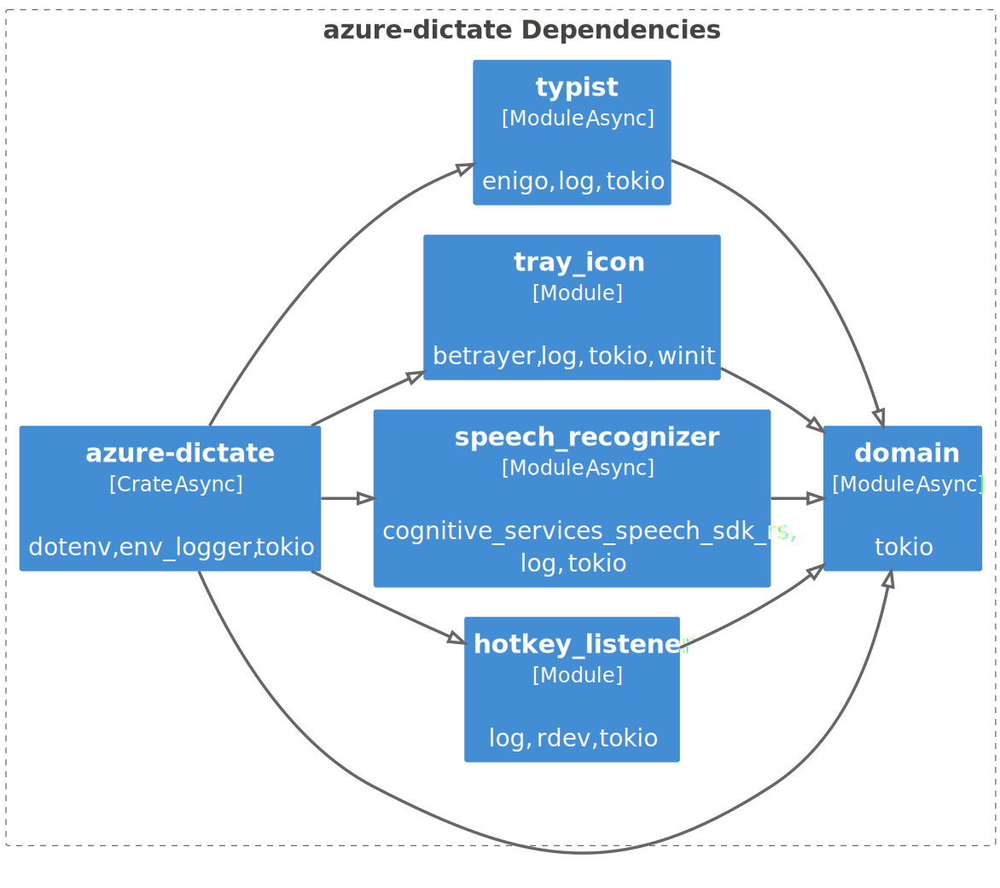

<!-- .slide: class="master-cover" -->

## Rust Clean Architecture

<br/>

### Rust Meetup Bern<br>20.1.2025
### Daniel Tschan
<!-- .element style="margin-bottom: 12rem" --->

-*-*-

## Where does Puzzle use Rust

* S3 Proxy
* Kubernetes Operators
* Kubernetes Admission Controllers
* Kubernetes Mainenance Jobs

-*-*-

## Rust Clean Architecture

* My experiences
* Basis for your own ideas and discussion
* Not exhausting, there are always other approaches

-*-*-

## Goal of Software Architecture

> The goal of software architecture is to minimize the human resources required
> to build and maintain the required system.
>
> &mdash; Robert C. Martin

-*-*-

## Clean Architecture


<!-- .element style="margin-left: 2rem; margin-bottom: -1rem;" -->

Circles are just exemplary
<!-- .element style="font-size: smaller;" --->

-*-*-

## Clean Architecture Principles

* Dependency rule
  * Inner circles must not depend on outer circles
* Separation of concerns
  * A component should have only one reason to change
* Use case-centric
  * System is designed around business rules

note:
* https://bitloops.com/docs/bitloops-language/learning/software-architecture/clean-architecture

-*-*-

## Clean Architecture Implementation
<!-- .element style="font-size: 1.5em;" --->

* Implement components as Rust modules
* Implement business rules and use cases as separate components
* Access other components through interfaces
  * Traits and generics
  * Events and channels
  * ...

-*-*-

## Clean Architecture Implementation
<!-- .element style="font-size: 1.5em;" --->

* Use separate data models for each circle and each use case
* Map data and errors at architectural boundaries
* Use dependency injection to connect components
* Make conscious shortcuts

-*-*-

## Conscious Shortcuts

* Typical shortcuts:
  * Sharing models between use cases
  * Using domain model as input/output model
  * Skipping incoming ports
* Document with Architectural Decision Records
* Reasoning might no longer be valid in the future

-*-*-

## Example 1: Admission Controller

<!-- .slide: class="master-title" -->

-*-*-

## Example 1: Admission Controller

* Mutating Kubernetes Admission Controller
* Initially implemented as VPA recommender
* Calculates and applies requests, limits and Java Heap sizes based on Promtheus metrics
* Architectural boundaries implemented with traits and generics

-*-*-

## Example 1 Module Dependencies
<!-- .element style="margin-top: -1rem;" --->


<!-- .element style="margin-left: -1rem; margin-right: -4rem; margin-top: 0rem" -->

Naming based on Hexagonal, aka Ports & Adapters architecture
<!-- .element style="font-size: smaller; margin-top: 0.5rem;" --->

-*-*-

## Port Examples

```rust
#[trait_variant::make(MetricsPort: Send)]
#[allow(dead_code)]
pub trait LocalMetricsPort {
    async fn get_pod_metrics(
        &self,
        namespace: &str,
        pod_selector: &LabelSelector,
        range: u64,
    ) -> Result<PodMetricsOverTime, Report>;
}

#[trait_variant::make(Recommender: Send)]
#[allow(dead_code)]
pub trait LocalRecommender {
    async fn update_recommendations(&self) -> Result<(), Report>;
    async fn get_pod_recommendation(
        &self,
        namespace: &str,
        labels: &BTreeMap<String, String>,
    ) -> Result<Option<PodRecommendation>, Report>;
}
```
<!-- .element class="very-big" --->
 
Macros should become obsolete when AFIT matures
<!-- .element style="font-size: smaller; margin-top: -1rem;" --->

-*-*-

## Domain Models

```rust
#[derive(Debug, Default, Clone, Serialize, Deserialize, PartialEq, JsonSchema)]
pub struct ContainerRecommendation {
    pub memory_request_mib: Option<u32>,
    pub memory_limit_mib: Option<u32>,
    pub cpu_request_millicores: Option<u32>,
    pub cpu_limit_millicores: Option<u32>,
    pub jvm_max_heap_mib: Option<u32>,
}

#[derive(Debug, Clone)]
pub struct ContainerRecommendationConstraints {
    pub min: Option<ContainerRecommendation>,
    pub max: Option<ContainerRecommendation>,
}
```

No invariants => public attributes
<!-- .element style="font-size: smaller; margin-top: -1rem;" --->

-*-*-

## Data Mapping

* Implement in outer layers
* Directly access model
* Implement `From`/`TryFrom`/`FromStr`
* Implement `from_`/`to_` methods

-*-*-

## Data Mapping Example

```rust
impl TryFrom<ResourcePolicy> for ContainerRecommendation {
    type Error = Report;

    fn try_from(value: ResourcePolicy) -> Result<Self, Self::Error> {
        Ok(Self {
            memory_request_mib: value
                .requests
                .get("memory")
                .map(|v| v.to_mib())
                .transpose()?,
            // ...
        })
    }
}
```

* Implemented in Kubernetes adapter
<!-- .element style="font-size: smaller; margin-left: -3.3rem; margin-top: -0.5rem;" --->
* ResourcePolicy is part of the controllers VPA custom resource
<!-- .element style="font-size: smaller; margin-left: -3.3rem; margin-top: 0.5rem;" --->

-*-*-

## Error Mapping

* Define error variants based on port operations
  * Only add data required for pattern matching
  * Capture other context with `tracing-error`
    * Function arguments, source errors and traces
    <!-- .element style="font-size: 0.85em; margin-left: -1rem;" --->
* Wrap errors at boundaries

-*-*-

## Error Mapping

* Erase source error types at boundaries
  * Usually with `Box<dyn Error>`
* `color-eyre` or `error-stack` help with all that
  * &rArr; Simple  error types
  * `Report` or `Report<T>` in method signatures
* Rust will get its own `Report` type

-*-*-

## Domain Error Example

```rust
use thiserror::Error;

#[derive(Debug, Clone, Error)]
pub enum Error {
    #[error("Failed to retrieve LagoonVPA resources from the cluster")]
    VpaRetrieval,

    #[error("Failed to save pod recommendation")]
    PodRecommendationSave,

    #[error("Failed to load pod recommendation")]
    PodRecommendationLoad,

    #[error("Failed to retrieve container metrics")]
    ContainerMetricsRetrieval,

    // ...
```

-*-*-

## ColorEyre Example Error Log

<pre style="background-color: #3F3F3F; color: lightgrey; white-space: pre-wrap; font-size: 0.4em;">
Feb 19 11:29:34.305 <span style="color:white;background-color:#9e61b6;">│WRN│</span> <span style="font-weight:bold;">Failed to update recommendations </span><span style="color:#a6e22e;">target</span>=lagoon_vpa_admission_controller::adapter::admission_server <span style="color:#a6e22e;">span</span>=update_recommendations <span style="color:#a6e22e;">span-path</span>=run&gt;update_recommendations <span style="color:#a6e22e;">report</span>=`
   0: Failed to update recommendations
   1: Failed to retrieve LagoonVPA resources from the cluster
   2: ApiError: deployments/scale.apps &quot;oops&quot; not found: NotFound (ErrorResponse { status: &quot;Failure&quot;, message: &quot;deployments/scale.apps \&quot;oops\&quot; not found&quot;, reason: &quot;NotFound&quot;, code: 404 })
   3: deployments/scale.apps &quot;oops&quot; not found: NotFound

Location:
   src/adapter/kubernetes.rs:68

  ━━━━━━━━━━━━━━━━━━━━━━━━━━━━━━━━━━ SPANTRACE ━━━━━━━━━━━━━━━━━━━━━━━━━━━━━━━━━━━

   0: lagoon_vpa_admission_controller::adapter::kubernetes::get_scale_subresource
      at src/adapter/kubernetes.rs:56
   1: lagoon_vpa_admission_controller::adapter::kubernetes::get_vpa_specs with namespace="vpa-test" vpa="oops" target_ref=CrossVersionObjectReference { api_version: Some(&quot;apps/v1&quot;), kind: &quot;Deployment&quot;, name: &quot;oops&quot; }
      at src/adapter/kubernetes.rs:73
   2: lagoon_vpa_admission_controller::domain::update_recommendations
      at src/domain.rs:34
   3: lagoon_vpa_admission_controller::adapter::admission_server::update_recommendations
      at src/adapter/admission_server.rs:259
   4: lagoon_vpa_admission_controller::adapter::admission_server::run
      at src/adapter/admission_server.rs:270
</pre>

Log in logfmt format piped through log viewer [hl](https://github.com/pamburus/hl)
<!-- .element style="font-size: smaller; margin-top: -1rem;" --->

-*-*-

## Outgoing Adapter Example

```rust
#[derive(Clone)]
pub struct PrometheusMetricsAdapter {
    client: Client,
}

impl PrometheusMetricsAdapter {
    pub fn new(client: Client) -> Self {
        Self { client }
    }
    // ...
}

impl MetricsPort for PrometheusMetricsAdapter {
    #[instrument(skip(self))]
    async fn get_pod_metrics(
        &self,
        namespace: &str,
        pod_selector: &LabelSelector,
        range: u64,
    ) -> Result<PodMetricsOverTime, Report> {
      // ...
```
<!-- .element class="very-big" --->


-*-*-

## Incoming Adapter Example

```rust
pub struct AdmissionServer<R> {
    recommender: R,
}

impl<R: Recommender + Clone + Sync + 'static> AdmissionServer<R> {
    pub fn new(recommender: R) -> Self {
        Self { recommender }
    }

    #[instrument(skip(self))]
    async fn update_recommendations(&self) {
        loop {
            if let Err(e) = self.recommender.update_recommendations().await {
                warn!(report = ?e, "{}", e);
            }

            sleep(Duration::from_secs(3600)).await;
        }
    }

    // ...
```
<!-- .element class="very-big" --->

Trait bounds needed by Warp server handler
<!-- .element style="font-size: smaller;" --->

-*-*-

## Configuration Component


```rust
// ... cli, env var parsing and Prometheus client creation above

let kubernetes_client: kube::Client =
    kube::Client::try_default().await.wrap_err(Error::Config)?;

let kubernetes_adapter = KubernetesAdapter::new(kubernetes_client);
let metrics_adapter = PrometheusMetricsAdapter::new(prometheus_client);
let recommender = LagoonRecommender::new(
    kubernetes_adapter.clone(),
    metrics_adapter,
    kubernetes_adapter,
);
let admission_controller = AdmissionServer::new(recommender);

admission_controller.run().await;
```
<!-- .element class="very-big" --->

* Dependency injection by moving owned values
<!-- .element style="font-size: smaller; margin-left: -3.3rem; margin-top: -0.5rem;" --->
* Kubernetes adapter implements 2 ports
<!-- .element style="font-size: smaller; margin-left: -3.3rem; margin-top: 0.5rem;" --->
* Implemented in adapter module => private child modules
<!-- .element style="font-size: smaller; margin-left: -3.3rem; margin-top: 0.5rem;" --->

-*-*-

## Enforcing Arch Boundaries

* I.e. enforcing that dependencies point in right direction
* Visibility modifiers prevent access between circles
* Compile-time fitness function needed to prevent access between adapters

-*-*-

## Async Strategies

* Make the whole project async
  * Port functions need to be async
  * Best performance
  * Domain logic contains async code
  * Recommended when most adapters are async

-*-*-

## Async Strategies

* Only make some adapters async
  * Ports and domain logic are sync
  * Outgoing adapters must run async code on runtime
  * Overhead for sync => async
  * Recommended when most adapters are sync

-*-*-

## Sync => Async: Extension Trait

```rust
pub trait SyncFutureExt: Future + Sized {
    fn sync(self) -> Self::Output {
        if let Ok(handle) = Handle::try_current() {
            // We're already inside a Tokio runtime.
            task::block_in_place(|| handle.block_on(self))
        } else {
            // Not inside a runtime: create a current-thread runtime.
            let rt = Builder::new_current_thread()
                .enable_all()
                .build()
                .expect("Failed to create current-thread Tokio runtime");
            rt.block_on(self)
        }
    }
}

impl<F: Future> SyncFutureExt for F {}
```
<!-- .element class="very-big" --->

<div>

* `block_in_place` requires multi-threaded runtime
* `rt` may need to be cached if called in tight loop

</div>
<!-- .element style="font-size: smaller; margin-left: -3rem; margin-top: -1.5rem;" --->

-*-*-

## Sync => Async: Extension Trait

```rust
use crate::adapter::SyncFutureExt;

let promql_result = self.client.query(&query).get().sync()?;
```
<!-- .element class="very-big" --->

`sync()` can be used like `await` to call async code from sync code
<!-- .element style="font-size: smaller;" --->

-*-*-

## Example 2: Dication Tool

<!-- .slide: class="master-title" -->

-*-*-

## Example 2: Dication Tool

* Turns spoken text into keypresses
* Prototype for hardware solution
* Architectural boundaries implemented with events and channels

-*-*-

## Example 2 Module Dependencies
<!-- .element style="margin-top: -1rem;" --->

<center>


 <!-- .element style="margin-top: -1rem;" width="75%" -->

</center> 

-*-*-

## Events

```rust

#[derive(Debug, Copy, Clone)]
pub enum UserEvent {
    RequestLanguageChange(Language),
    RequestRecordingToggle,
}

#[derive(Debug, Copy, Clone)]
pub enum DictationEvent {
    LanguageChange(Language),
    Start,
    Stop,
}

#[derive(Debug, Clone)]
pub enum TextEvent {
    IntermediateText(String),
    FinalText(String),
    Reset,
}
```

-*-*-

## Adapter Example

```rust
pub struct Speech {
    speech_recognizer: Box<msspeech::speech::SpeechRecognizer>,
    dictation_receiver: broadcast::Receiver<DictationEvent>,
    text_sender: mpsc::Sender<TextEvent>,
}

impl Speech {
    pub async fn run(&mut self) {
        while let Ok(event) = self.dictation_receiver.recv().await {
            match event {
                DictationEvent::LanguageChange(language) => {
                    self.speech_recognizer = Self::new_speech_recognizer(
                        language,
                        self.text_sender.clone()
                    );
                }
                DictationEvent::Start => {
                    self.start().await;
                }
                DictationEvent::Stop => {
                    self.stop().await;
                }
            }
        }
    }
}
```
<!-- .element class="very-big" style="margin-top: 0rem;" --->

-*-*-

## Configuration Component

```rust
    let (dictation_sender, dictation_receiver) = broadcast::channel(100);
    let (user_sender, user_receiver) = mpsc::channel(100);
    let (speech_sender, speech_receiver) = mpsc::channel(100);
    let (text_sender, text_receiver) = mpsc::channel(100);

    let hotkey_listener = HotkeyListener::new(user_sender.clone());
    let tray_icon = TrayIcon::new(dictation_sender.subscribe(), user_sender);
    let mut typist = Typist::new(text_receiver);
    let mut speech = Speech::new(dictation_receiver, speech_sender);
    let mut dictation_orchestrator =
        DictationOrchestrator::new(
            user_receiver,
            dictation_sender,
            speech_receiver,
            text_sender
        );
```

-*-*-

## Configuration Component

```rust
    thread::spawn(move || {
        tokio::runtime::Builder::new_current_thread()
            .enable_all()
            .build()
            .unwrap()
            .block_on(async move {
                join!(speech.run(), typist.run(), dictation_orchestrator.run());
            }
        );
    });

    thread::spawn(move || {
        hotkey_listener.run();
    });

    // Tray icon must run in main thread
    tray_icon.run()?;
```
<!-- .element style="margin-top: 0rem;" --->

-*-*-

## Conclusion

* Rust forces you to think about architecture more
* A clean architecture helps with Rust ownership
* Rust has all the tools for a clean architecture, no need for DI or data mapping frameworks
* No/low overhead thanks to zero cost abstractions
* Coding AIs generate better results for clean projects and help with data mapping, etc.
* There's more to Clean Architecture, e.g. testing

-*-*-

## Resources

* [Introduction to Clean Architecture](https://bitloops.com/docs/bitloops-language/learning/software-architecture/clean-architecture)
* [Get Your Hands Dirty on Clean Architecture by Tom Hombergs](https://reflectoring.io/book/)
* [Clean Architecture by Robert C. Martin](https://www.pearson.ch/clean-architecture-a-craftsmans-guide-to-software-structure-and-design-9780134494166)

-*-*-

## Deleted Slides

<!-- .slide: class="master-title" -->

-*-*-
## Main/Configuration Component

* Loads configuration
* Sets up logging
* Instantiates adapters, usually as owned objects
* Instantiates core business component
* Injects configuration into components
* Injects adapters into core business component, usually by moving them

-*-*-

## Dependeny Injection

* What if an object needs to be injected multiple times?
  * If struct is stateless just clone it
  * If struct is stateful implement wrapper, e.g. using `Arc<Mutex<T>>`
  * Or use message passing with channels

-*-*-

## Sync Wrapper

```rust
use std::sync::Arc;
use tokio::sync::Mutex;  // Tokio mutex must be used in async context

#[derive(Clone)]
struct SyncRecommender<R> {
    inner: Arc<Mutex<R>>,
}

impl<R: Recommender> SyncRecommender<R> {
    pub fn new(inner: R) -> Self {
        Self {
            inner: Arc::new(Mutex::new(inner)),
        }
    }
}

impl<R: Recommender> Recommender for SyncRecommender<R> {
    async fn update_recommendations(&mut self) -> Result<(), Report> {
        self.inner.lock().await.update_recommendations().await
    }
  
```
<!-- .element class="very-big" --->

-*-*-

## Incoming Adapter Example

```rust
    #[instrument(skip(self))]
    pub async fn run(&self) {
        let routes = warp::path("mutate")
            .and(warp::body::json())
            .and(with_recommender(self.recommender.clone()))
            .and_then(mutate_handler);

        let server = warp::serve(warp::post().and(routes))
            .tls()
            .cert_path("/certs/tls.crt")
            .key_path("/certs/tls.key")
            .run(([0, 0, 0, 0], 8443));

        info!("Admission controller server running on 0.0.0.0:8443");
        join!(self.update_recommendations(), server);
    }
}

/// Wrap the recommender in a filter
fn with_recommender(recommender: impl Recommender + Clone)
  -> impl Filter<Extract = (impl Recommender,), Error = Infallible> + Clone {
    warp::any().map(move || recommender.clone())
}
```
<!-- .element class="very-big" --->

-*-*-

## Business Logik Example

```rust
impl ContainerMetricsOverTime {
    pub fn compute_recommendations(&self) -> ContainerRecommendation {
        let jvm_max_heap_bytes = tryit! {
            let usage = self.max_over_time.java_live_data_set_bytes? +
            30.0 * self.max_over_time.java_allocation_rate_bytes_second?;
            Some(usage / 0.7)
        };

        // ...

        ContainerRecommendation {
            memory_request_mib: memory_request_bytes.map(
                |x| (x / (1024.0 * 1024.0)).ceil() as u32),
            memory_limit_mib: memory_limit_bytes.map(
                |x| (x / (1024.0 * 1024.0)).ceil() as u32),
            cpu_request_millicores: cpu_request_millicores.map(
                |x| x as u32),
            cpu_limit_millicores: cpu_limit_millicores.map(
                |x| x as u32),
            jvm_max_heap_mib: jvm_max_heap_bytes.map(
                |x| (x / (1024.0 * 1024.0)).ceil() as u32),
        }
    }
}
```
<!-- .element class="very-big" style="margin-top: 0rem;" --->
